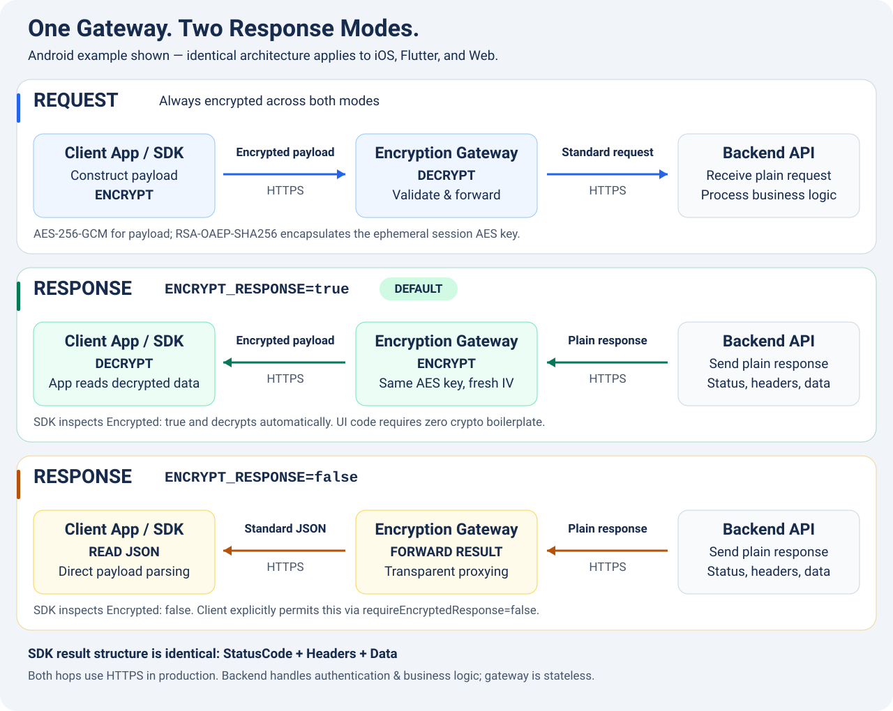

# Encryption Gateway Quick Start Guide

Comprehensive documentation is available in the main [README](../README.md): configuration, Docker deployment, public key distribution, client examples for Android/iOS/Flutter/Web, and API specifications.



## 1. Select Response Mode

```env
ALLOWED_ROUTES=POST api.example.com/api/login, GET api.example.com/api/profile
ALLOW_HTTP_UPSTREAM=false
ENCRYPT_RESPONSE=true
```

- `true` (default): Gateway encrypts upstream responses; client SDK decrypts them.
- `false`: Gateway forwards standard JSON over HTTPS; client must explicitly permit this via `requireEncryptedResponse=false`.

Requests are always encrypted in both modes. The SDK reads the `Encrypted` envelope flag and normalizes backend status, headers, and data into an identical result structure. UI application code requires zero conditional logic.

## 2. Deploy

```bash
cp .env.example .env
# Edit .env: replace demo targets with your production upstream and select response mode.
docker compose up -d --build
```

Deploy an HTTPS reverse proxy (e.g. Caddy/Nginx) in front of `127.0.0.1:3000`, then securely distribute the public key and `keyId` from `/public-key`. Configure `TRUST_PROXY` according to your proxy topology.

Generated RSA keys are stored in the persistent named volume `gateway-keys`. Retain this volume across redeployments. The gateway is completely stateless and requires no database or cache.

After modifying `.env`:

```bash
docker compose up -d --force-recreate gateway
```

## 3. Client SDKs

Copy the corresponding client helper and initialize it once with the gateway URL, public key, and `keyId`:

- [Android / Kotlin (GatewayClient)](../clients/android/GatewayClient.kt)
- [iOS / Swift (GatewayClient)](../clients/ios/GatewayClient.swift)
- [Flutter / Dart (GatewayClient)](../clients/flutter/gateway_client.dart)
- [Web / JavaScript (GatewayClient)](../clients/web/gatewayClient.js)

Default `requireEncryptedResponse=true` rejects plaintext responses. If your app allows both modes, set `false`; the SDK will still decrypt responses if the server returns encrypted envelopes.

Web example:

```javascript
const result = await gateway.send({
  method: 'POST',
  accessPoint: 'https://api.example.com/api/login',
  headers: { 'Content-Type': 'application/json' },
  body: { email: 'user@example.com', password: 'secret' },
});
// result: { StatusCode, Headers, Data }, normalized across both modes.
```

Always check `result.StatusCode` for the backend status code. An HTTP 200 from the gateway confirms successful envelope transport, not upstream application success. See [full integration examples in README](client-sdks.md).

## 4. Testing

```bash
npm test -- --runInBand        # Unit tests
npm run test:e2e -- --runInBand # E2E tests
npm run test:clients           # Web client tests
npm run build                 # Production compilation
```
