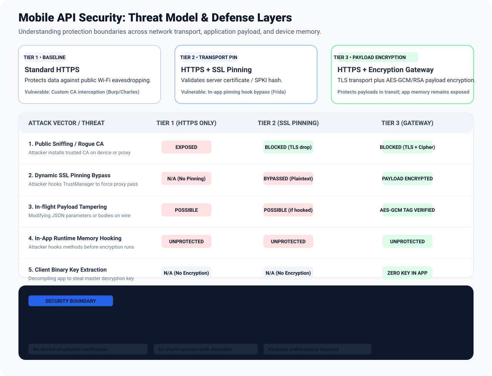

# Security model

## Threat Model & Defense-in-Depth

This section provides an honest threat model outlining what the Encryption Gateway protects, what it does **not** protect, and how to combine it with client-side defenses for complete end-to-end security.

```text
+-----------------------------------------------------------------------------------------+
|                                  Mobile Client Device                                   |
|                                                                                         |
|  [ Layer 1: Client Runtime & Memory (Process Boundary) ]                                |
|  * Optional client-side app hardening:                                                 |
|    - Frida & dynamic hooking detection (port scans, /proc/self/maps, thread monitors)   |
|    - Root, Magisk, KernelSU, and Emulator sandbox detection                            |
|    - Hardware Key Attestation & signing certificate verification                        |
|                                     |                                                   |
|                                     v                                                   |
|  [ Layer 2: Application Payload Encryption (GatewayClient) ]                            |
|  - Generates ephemeral AES-256 session key & 12-byte IV per request                     |
|  - Encrypts JSON body with AES-256-GCM (128-bit authentication tag)                      |
|  - Encapsulates session key using RSA-OAEP SHA-256 with gateway public key              |
|                                     |                                                   |
|                                     v                                                   |
|  [ Layer 3: Network Transport Security (Wire Boundary) ]                                |
|  * Protected by TLS + Certificate / SPKI Pinning:                                       |
|    - Drops untrusted TLS handshakes before transmission                                 |
+-------------------------------------|---------------------------------------------------+
                                      |
                                      | Wire Ciphertext: TLS + AES-256-GCM / RSA-OAEP
                                      v
+-----------------------------------------------------------------------------------------+
|                                Encryption Gateway Server                                |
|  - Unwraps RSA-OAEP & decrypts AES-256-GCM in memory                                    |
|  - Validates GCM authentication tag (rejects tampered payloads with HTTP 400)           |
|  - Enforces route whitelist and rate limits before forwarding                           |
|  - Forwards plaintext request via private HTTPS to internal Backend APIs                |
+-----------------------------------------------------------------------------------------+
```



[View full-size SVG](images/attack-defense-matrix.svg).

### Threat Matrix: What Is Protected vs. What Is Not

| Attack Vector | Standard HTTPS | HTTPS + SSL Pinning | Gateway Alone | Gateway + Client App Hardening |
|---|:---:|:---:|:---:|:---:|
| **Public Wi-Fi Sniffing (Passive)** | Protected by TLS | Protected | Protected | **Protected** |
| **Rogue CA / Proxy Interception (Burp/Charles)** | Vulnerable (Exposed) | Blocked by Pinning | Protected on wire (Ciphertext) | **Protected** (Pinning drops TLS; wire is ciphertext) |
| **SSL Pinning Bypass via Hooking** | N/A | Vulnerable (Plaintext exposed) | Protected on wire (Ciphertext) | **Protected** (Frida detected & execution blocked) |
| **In-Flight Wire Payload Tampering** | Vulnerable via proxy | Vulnerable if pinning bypassed | Blocked (GCM tag verification) | **Blocked** (GCM tag verification) |
| **In-App Memory Hooking (Frida / Xposed)** | Vulnerable | Vulnerable | **Vulnerable** (Hooking reads pre-encryption data) | **Mitigated** (Detects Frida/Root & blocks app execution) |
| **Client Decompilation & Key Theft** | N/A | N/A | Protected (Private key never in client) | **Protected** (Private key on server + R8 obfuscation) |

### Understanding the Boundaries

1. **What the Gateway Protects (Wire Boundary):**
   - **Confidentiality on untrusted networks:** Even if an attacker installs a user CA certificate and routes traffic through Burp Suite or Charles Proxy, the intercepted HTTP body is authenticated AES-GCM ciphertext wrapped with RSA-OAEP.
   - **Integrity against wire modification:** Modifying even a single bit of the ciphertext causes AES-GCM tag verification to fail on the gateway, rejecting the request with HTTP 400.
   - **Backend Isolation:** Backend microservices stay in an isolated private VPC and are never exposed directly to the public internet.

2. **What the Gateway Cannot Protect Alone (Process Memory Boundary):**
   - **Client-Side Dynamic Hooking:** Payload encryption occurs inside the client application process. If an attacker runs Frida or Xposed on a rooted device, they can hook `GatewayClient.send()` **before** encryption takes place or **after** response decryption completes, reading plaintext directly from memory.
   - **Client-Side Key Extraction:** The gateway's *public key* is embedded in the client and is public by design. Anyone can extract it and craft valid encrypted requests. Authentication must remain enforced by backend authorization tokens.

3. **Client app hardening:**
   - Teams may add platform-specific runtime integrity checks, device attestation, and tamper resistance to their own apps. These controls are outside this gateway: it does not verify device attestation or detect rooted, jailbroken, or instrumented clients.

### ProGuard / R8 Configuration

**Do not** use `-keep` on `GatewayClient` itself. Keeping the client class un-obfuscated makes it easier for an attacker with Jadx or Frida to locate encryption functions in memory. Allow R8 to fully obfuscate `GatewayClient`.

Only preserve model serialization annotations if your application deserializes gateway responses into DTOs using Gson or Kotlin Serialization:

```proguard
# Preserve reflection metadata for JSON serialization models only
-keepattributes Signature, InnerClasses, EnclosingMethod
-keepclassmembers class * {
    @com.google.gson.annotations.SerializedName <fields>;
}

# Allow R8 to fully obfuscate GatewayClient helper
# (No -keep rule required for GatewayClient)
```

### Technical Differences: Android vs iOS

#### 1. Android / Flutter (Android)
- **Code Obfuscation (R8):** Android uses DEX bytecode which decompiles to readable Java/Kotlin source if left un-obfuscated. Always enable R8 (`isMinifyEnabled = true`) in `build.gradle.kts` so internal class and method names are mangled into unintelligible identifiers.
- **SSL Pinning:** Declaratively configured in `res/xml/network_security_config.xml` (SHA-256 SPKI pin-set) or via `CertificatePinner` on OkHttp.

#### 2. iOS / Flutter (iOS)
- **No ProGuard in iOS:** iOS compiles directly to **native machine code (Mach-O binary)** via LLVM/Clang. In *Release* mode, Xcode automatically performs dead code stripping and symbol stripping (`STRIP_INSTALLED_PRODUCT = YES`), preventing readable method names from persisting in the binary like Android DEX bytecode.
- **iOS Hardening Focus:** Focus on runtime integrity checks (Jailbreak detection checking Cydia/Sileo file system paths) and anti-debugging (`PT_DENY_ATTACH` via `ptrace`).
- **SSL Pinning:** Implemented via `URLSessionDelegate` (`urlSession(_:didReceive:completionHandler:)` evaluating the `serverTrust` public key hash) or using battle-tested libraries such as **TrustKit**.

## Security Boundaries & Limitations

- Standard response mode relies on HTTPS for confidentiality and integrity. If the HTTPS transport is intercepted, standard responses can be read or modified by the intercepting party.
- Payload encryption is not a replacement for authentication or authorization. Anyone in possession of the public key can craft valid encrypted requests; backend services must always authenticate identity and verify permissions.
- The gateway is designed specifically for JSON and text payloads. POST/PUT/PATCH/DELETE request bodies are forwarded; GET request bodies are omitted. Streaming responses, multipart file uploads, WebSockets, and arbitrary binary streaming are out of scope.
- Hop-by-hop headers, `Host`, headers declared in `Connection`, and client-provided proxy forwarding headers are stripped. Upstream services must never trust identity headers without mutual server authentication.
- Gateway rate limiting is in-memory and per process. Behind several replicas or serverless instances each one counts separately, so it throttles abusive clients but is not a strict global quota.
- `TRUST_PROXY` changes which forwarded address Express treats as the client IP. Set it only to the actual trusted proxy hop count or subnet, and ensure that proxy overwrites client-supplied forwarding headers. A broad trust setting can let clients spoof rate-limit identity.
- The route allowlist checks URL host and path before the HTTP client resolves DNS. Deploy with outbound network controls that prevent access to cloud metadata, loopback, link-local, and private networks unless those destinations are intentional upstreams. Host allowlisting alone does not pin DNS answers.
- Upstream HTTP redirects are not followed. Restrict targets strictly to trusted backends; route whitelisting does not replace internal network segmentation.
- Requests can be replayed. AES-GCM authenticates request contents, but the gateway does not keep a nonce or request history. Protect non-idempotent operations with backend authentication, idempotency keys, or replay checks.
- The gateway does not implement Android Key Attestation, Apple App Attest, or client runtime protection. Application teams must implement and verify those controls in their own systems if needed.
- Encrypted responses cannot prevent inspection on compromised devices where the application memory is modified: client applications ultimately decrypt data into plaintext to render it.
